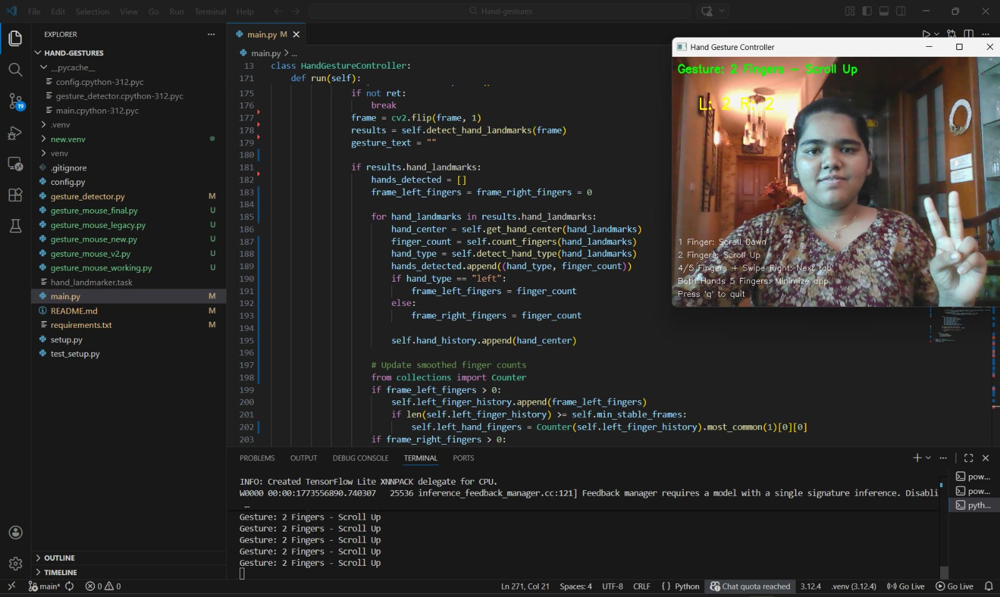

# 🖐 Hand-Gesture Recognition

A Python application that uses computer vision to detect hand gestures and control mouse/keyboard actions in real-time. 🚀

---

## ✨ Features

- **Scroll Control**
  - 1️⃣ finger: Scroll down
  - 2️⃣ fingers: Scroll up
- **Tab Switching**: 4️⃣ or 5️⃣ fingers + swipe ➡️
- **Application Control**: Both hands showing 5️⃣ fingers each to minimize the current app 🖥️
- Real-time hand detection using **MediaPipe Tasks API** 🤖
- Supports left ✋ + right ✋ hands

---

## 🛠 Requirements

- Python 3.7+
- Webcam 📷
- Windows / macOS / Linux 💻

---

## ⚡ Installation

1. Clone or download the repository
2. Create and activate a virtual environment (recommended):
   ```bash
   python -m venv venv
   # Windows (PowerShell)
   venv\Scripts\Activate.ps1
   # Windows (cmd.exe)
   venv\Scripts\activate.bat
   # Linux / macOS
   source venv/bin/activate
   ```
3. Install Python dependencies:
   ```bash
   pip install -r requirements.txt
   ```
4. Download the MediaPipe hand landmark model file (required):
   ```bash
   curl -o hand_landmarker.task https://storage.googleapis.com/mediapipe-models/hand_landmarker/hand_landmarker/float16/1/hand_landmarker.task
   ```

## Running

Start the application:
```bash
python main.py
```

A window will open displaying your webcam feed.

- Press **q** to quit

 ## 🎬 Demo
 


## 🤌 Gestures

- **Scroll Down**: 1️⃣ finger  
- **Scroll Up**: 2️⃣ fingers  
- **Next Tab**: 4️⃣ or 5️⃣ fingers + swipe ➡️  
- **Minimize App**: 5️⃣ fingers on both hands 🖥️

---

## 🐞 Troubleshooting

- If you see `ModuleNotFoundError`, ensure you activated the virtual environment and ran `pip install -r requirements.txt`.  
- If gestures aren’t detected:  
  - Ensure the model file (`hand_landmarker.task`) is in the project root 📂  
  - Use good lighting 💡 and keep your hands in view of the webcam 📷  
  - Try moving your hand closer/further to the camera 🔄

---

## 📁 Project Structure

- `main.py`: Main app loop + gesture processing 🎬  
- `gesture_detector.py`: MediaPipe hand landmark detector wrapper 🤖  
- `config.py`: Basic settings (camera index, text position, etc.) ⚙️  
- `requirements.txt`: Python dependencies 📦

---

## 📦 Dependencies (`requirements.txt`)

- `opencv-python` 🖼️  
- `mediapipe` 🤖  
- `numpy` 🔢  
- `pyautogui` 🖱️  
- `keyboard` ⌨️

---
## 🛠️ Tech Stack

- **Python** 🐍 – Main programming language  
- **OpenCV** 🖼️ – Computer vision library for webcam and image processing  
- **MediaPipe** 🤖 – Hand landmark detection and gesture recognition  
- **NumPy** 🔢 – Numerical computations  
- **PyAutoGUI** 🖱️ – Control mouse/keyboard with gestures  
- **Keyboard** ⌨️ – Keyboard event handling  

## 📝 Notes

- The `hand_landmarker.task` file is large (~15MB) and is ignored by Git (`.gitignore`). Download it separately as shown above ⬇️  
- If you want to run this without a virtual environment, ensure packages are installed globally 🌐, but using a venv is strongly recommended ✅
  
## 👩‍💻 Author
Kareena Treesa Thomas- 💻🚀 – Tech enthusiast and aspiring developer. 
GitHub: https://github.com/Kareena-Treesa-Thomas
